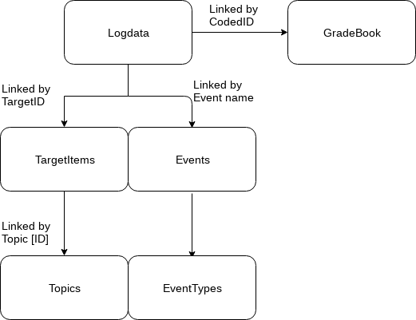

README
================
salopant
2 November 2018

This course, Introduction to Open Data Science, will teach me how to
utilize the open data in data science projects. I will learn how to
scrap, wrangle and analyse the data and how to collaborate with other
people using tools such as Github and R studio.

My course diary can be found at
<https://salopant.github.io/IODS-project/>

##### Logdata.csv - Log data extracted from Moodle, all actions recorded, preprocessed for anonymity
Fields:
+ Day - day of month of event (int)
+ Month - month of event (int)
+ Time - time of event (hh:mm:ss)
+ CodedUserId - Anonymized user id of the event actor, refers to Gradebook data row
+ Target_type - Moodle implementation item, (Moodle) type of the item
+ Target_Id - Moodle implementation item id
+ ContentType - Moodle implementation item, course type of the item
+ TargetItem - Moodle implementation item title
+ Component - Moodle implementation item name, (Moodle) type of the item
+ Event name - Action by the user/system on target Moodle item

##### Gradebook.csv - Grades of students from course tasks and exam
Fields:
+ CodedId - 
+ dateOfExam
+ CourseGrade
+ Test your knowledge on data types and variables 
+ Ex1 VPL upload link 
+ Ex5 submission, tasks 1 - 3 
+ Ex5 submission, tasks 4 - 6 
+ Ex6 submission, tasks 1 - 3 
+ Ex7 submission, tasks 1 - 4 
+ Ex8 submission, tasks 1 - 3 
+ Ex8 submission, tasks 4 - 5 
+ Ex8 submission, tasks 6 - 7 
+ Ex9 submission, tasks 1 - 4 
+ Ex9 submission, tasks 5 - 6 
+ Ex10 submission, all tasks 
+ Ex11 submission, all tasks 
+ Ex12 submission, all tasks 
+ Ex12 submission, all tasks 
+ Ex7 submission, tasks 5 - 6 
+ Ex7 submission, tasks 7 - 8 
+ Ex6 submission, tasks 4 - 7 
+ Ex2 submission here 
+ Ex3, return link (all tasks automatically assessed, need to collect 3/5 to pass) 
+ Ex0:  Hello World 
+ Ex4, return link, need to collect 3/5 to pass 
+ Test your knowledge! 
+ Test your knowledge of basic concepts 
+ Self assessment Tasks #5 
+ EX12:  I am done, I want to see the model solutions 
+ EX11:  I am done, I want to see the model solutions 
+ EX10:  I am done, I want to see the model solutions 
+ EX9, tasks 5&6:  I am done, I want to see the model solutions 
+ EX9, tasks 1 to 4:  I am done, I want to see the model solutions 
+ EX8, tasks 1 - 3:  I am done, I want to see the model solutions 
+ EX7, tasks 1 - 4:  I am done, I want to see the model solutions 
+ EX6, tasks 4 - 7:  I am done, I want to see the model solutions 
+ EX6, tasks 1 - 3:  I am done, I want to see the model solutions 
+ EX7, tasks 5&6:  I am done, I want to see the model solutions 
+ EX7, tasks 7&8:  I am done, I want to see the model solutions 
+ EX8, tasks 4 -5:  I am done, I want to see the model solutions 
+ EX8, tasks 6&7:  I am done, I want to see the model solutions 
